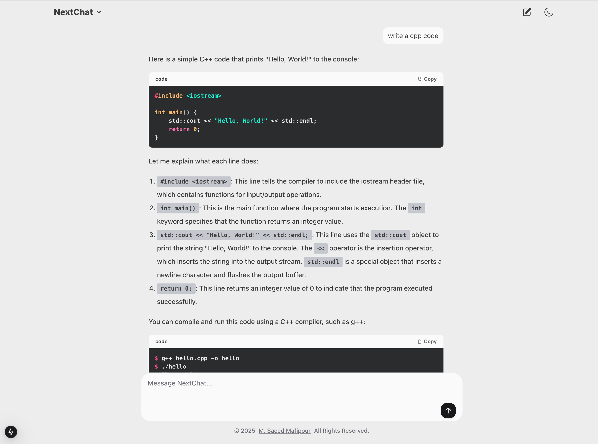

# NextChat

NextChat is a Next.js-powered AI chat application that integrates large language models (LLMs) to provide intelligent and responsive conversations.



[Live Demo](https://next-chat-app-umber.vercel.app/)

## Features

- **LLM Integration** – Supports 10 large language models (LLMs) for AI-powered chat functionality.
- **Real-time Chat** – Seamless and responsive chat experience.
- **Modern UI** – Built with Tailwind CSS for a clean and sleek design.
- **Responsive UI** – Optimized for both desktop and mobile devices.

## Getting Started

### Prerequisites

Ensure you have Node.js and a package manager (npm, yarn, pnpm, or bun) installed.

### Installation

Clone the repository and install dependencies:

```bash
git clone https://github.com/MSaeedMp/next-chat-app.git
cd next-chat-app
npm install  # or yarn install or pnpm install or bun install
```
